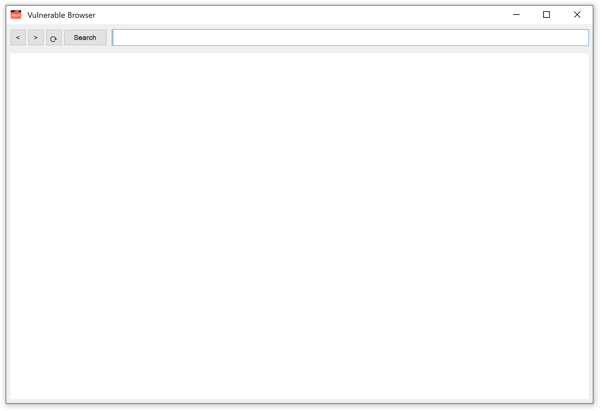

# SimpleBrowser (vulnerable)

- The vulnerable browser runs on CefSharp which has a chromium engine to run all the websites used in the demo.

<br/>



<br/>


## Pre-requisite

- Download and install Visual Studio 2022: https://visualstudio.microsoft.com/vs/community/


</br>

## Usage - vulnerable version

1. Open a terminal
2. Change the branch to "master" by typing the following:

```
git checkout master 
```
3. Simply open VulSimpleBrowser.sln
4. Right click on the "VulSimpleBrowser" project in the solution explorer > Debug > Start New Instance (or press start)

</br>

## Usage - Patched version (with punycode)

1. Open a terminal
2. Change the branch to "patched" by typing the following:

```
git checkout patched 
```
3. Simply open VulSimpleBrowser.sln
4. Right click on the "VulSimpleBrowser" project in the solution explorer > Debug > Start New Instance (or press start)

</br>
